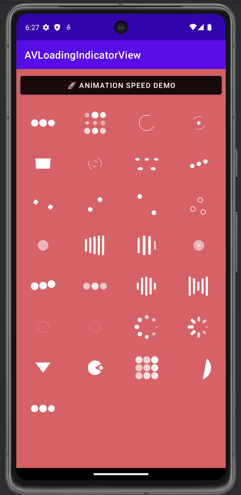

# AVLoadingIndicatorView

A customizable Android loading indicator library with multiple built-in animations and configurable speed control.

<div align="center">
  
</div>

<br/>
> [!NOTE]  
> This is a clone of [original repo](https://github.com/HarlonWang/AVLoadingIndicatorView).
> This project is created and pushed to Maven Central because the original repo is abandoned.

## ✨ Features

- 🎨 **28+ Built-in Indicators** - Wide variety of loading animations
- 🎛️ **Animation Speed Control** - Adjust animation speed from 0.25x to 3.25x
- 🎯 **Easy Integration** - Simple XML and programmatic usage
- 🔧 **Customizable** - Colors, sizes, and custom indicators
- 📱 **Lightweight** - Minimal footprint with smooth performance

## 📦 Installation

Add the dependency to your app's `build.gradle`:

```gradle
dependencies {
    implementation "io.github.maitrungduc1410:AVLoadingIndicatorView:2.2.0"
}
```

## 🚀 Quick Start

### Basic Usage

Add to your layout:

```xml
<com.wang.avi.AVLoadingIndicatorView
    android:id="@+id/avi"
    android:layout_width="wrap_content"
    android:layout_height="wrap_content"
    app:indicatorName="BallPulseIndicator"
    app:indicatorColor="@color/white" />
```

Control programmatically:

```java
AVLoadingIndicatorView avi = findViewById(R.id.avi);
avi.show();  // Start animation
avi.hide();  // Stop animation
```

### Animation Speed Control 🆕

Control animation speed via XML:

```xml
<com.wang.avi.AVLoadingIndicatorView
    android:layout_width="wrap_content"
    android:layout_height="wrap_content"
    app:indicatorName="BallPulseIndicator"
    app:indicatorColor="@color/white"
    app:animationSpeedMultiplier="2.0" />  <!-- 2x speed -->
```

Or programmatically:

```java
avi.setAnimationSpeedMultiplier(0.5f);  // Half speed
avi.setAnimationSpeedMultiplier(1.0f);  // Normal speed (default)
avi.setAnimationSpeedMultiplier(2.0f);  // Double speed
avi.setAnimationSpeedMultiplier(3.0f);  // Triple speed
```

## 📋 Available Indicators

| Indicator | Name |
|-----------|------|
| Ball Pulse | `BallPulseIndicator` |
| Ball Grid Pulse | `BallGridPulseIndicator` |
| Ball Clip Rotate | `BallClipRotateIndicator` |
| Ball Clip Rotate Pulse | `BallClipRotatePulseIndicator` |
| Square Spin | `SquareSpinIndicator` |
| Ball Clip Rotate Multiple | `BallClipRotateMultipleIndicator` |
| Ball Pulse Rise | `BallPulseRiseIndicator` |
| Ball Rotate | `BallRotateIndicator` |
| Cube Transition | `CubeTransitionIndicator` |
| Ball Zig Zag | `BallZigZagIndicator` |
| Ball Zig Zag Deflect | `BallZigZagDeflectIndicator` |
| Ball Triangle Path | `BallTrianglePathIndicator` |
| Ball Scale | `BallScaleIndicator` |
| Line Scale | `LineScaleIndicator` |
| Line Scale Party | `LineScalePartyIndicator` |
| Ball Scale Multiple | `BallScaleMultipleIndicator` |
| Ball Pulse Sync | `BallPulseSyncIndicator` |
| Ball Beat | `BallBeatIndicator` |
| Line Scale Pulse Out | `LineScalePulseOutIndicator` |
| Line Scale Pulse Out Rapid | `LineScalePulseOutRapidIndicator` |
| Ball Scale Ripple | `BallScaleRippleIndicator` |
| Ball Scale Ripple Multiple | `BallScaleRippleMultipleIndicator` |
| Ball Spin Fade Loader | `BallSpinFadeLoaderIndicator` |
| Line Spin Fade Loader | `LineSpinFadeLoaderIndicator` |
| Triangle Skew Spin | `TriangleSkewSpinIndicator` |
| Pacman | `PacmanIndicator` |
| Ball Grid Beat | `BallGridBeatIndicator` |
| Semi Circle Spin | `SemiCircleSpinIndicator` |

## 🔧 Configuration

### XML Attributes

| Attribute | Type | Description | Default |
|-----------|------|-------------|---------|
| `indicatorName` | string | Name of the indicator | `BallPulseIndicator` |
| `indicatorColor` | color | Color of the indicator | `Color.WHITE` |
| `animationSpeedMultiplier` | float | Animation speed multiplier (0.25-3.25) | `1.0` |
| `minWidth` | dimension | Minimum width | `24dp` |
| `maxWidth` | dimension | Maximum width | `48dp` |
| `minHeight` | dimension | Minimum height | `24dp` |
| `maxHeight` | dimension | Maximum height | `48dp` |

### Programmatic API

```java
// Basic controls
avi.show();
avi.hide();
avi.smoothToShow();
avi.smoothToHide();

// Customization
avi.setIndicator("BallPulseIndicator");
avi.setIndicatorColor(Color.BLUE);
avi.setAnimationSpeedMultiplier(1.5f);

// Getters
Indicator indicator = avi.getIndicator();
float speedMultiplier = avi.getAnimationSpeedMultiplier();
```

## 🎨 Custom Indicators

Create your own indicator by extending the `Indicator` class:

```java
public class MyCustomIndicator extends Indicator {
    @Override
    public void draw(Canvas canvas, Paint paint) {
        // Your drawing code here
    }

    @Override
    public ArrayList<ValueAnimator> onCreateAnimators() {
        // Your animation code here
        ArrayList<ValueAnimator> animators = new ArrayList<>();
        ValueAnimator animator = ValueAnimator.ofFloat(0, 1);
        animator.setDuration(1000);
        animator.setRepeatCount(-1);
        // ... configure animator
        animators.add(animator);
        return animators;
    }
}
```

Then use it:

```java
avi.setIndicator(new MyCustomIndicator());
// or
avi.setIndicator("com.yourpackage.MyCustomIndicator");
```

## 🤝 Contributing

1. Fork the repository
2. Create your feature branch (`git checkout -b feature/amazing-feature`)
3. Commit your changes (`git commit -m 'Add amazing feature'`)
4. Push to the branch (`git push origin feature/amazing-feature`)
5. Open a Pull Request

## ⭐ Show Your Support

If this library helped you, please give it a ⭐ on GitHub!
